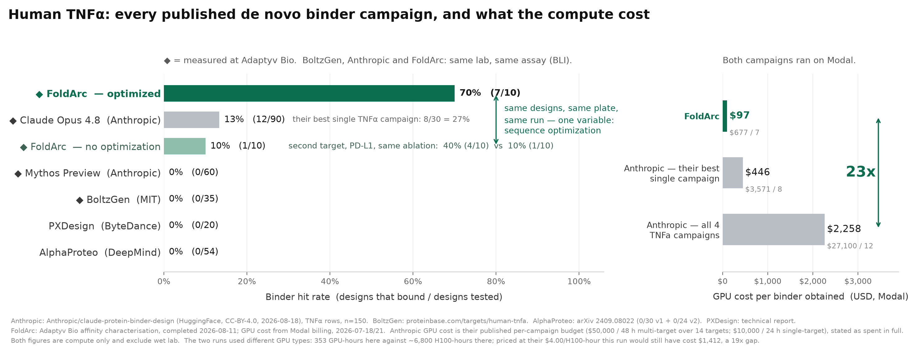

Anthropic reported 12 binders among 150 designs against TNFα, with an estimated compute cost of $27,100. In my campaign, seven of ten designs bound, and the compute bill was $677.

The campaigns used the same target, contract lab, assay, month, and compute provider. Claude was involved in both, although the design pipelines differed.

An important difference in my pipeline was an optimization stage that preserved a candidate's pose while its sequence changed. In a comparison arm without this stage, one of ten designs bound. In the optimized arm, seven of ten bound.

The experiments below describe how this optimization stage worked and why it may have reduced the compute required.

## Previous results on TNFα

TNFα is a difficult binder target. It is a homotrimer, and the receptor-binding surface runs along the seam between two subunits. DeepMind described the site as flat and highly polar, with relatively few hydrophobic contacts available for binding.

Four published campaigns had tested 169 designs against human TNFα before August. AlphaProteo reported 0 of 54, PXDesign 0 of 20, BoltzGen 0 of 35, and Anthropic's earlier Mythos Preview 0 of 60. Anthropic's new result, with 12 binders among 150 designs, was the first published non-zero campaign.

My campaign relied entirely on publicly available models and software. Backbones came from PXDesign, RFdiffusion3, and Complexa. ProteinMPNN generated sequences. Public filters removed clashes and weak hotspot contacts, Boltz-2 screened the remaining candidates, and mosaic, the optimization library released by Escalante Bio, performed the final sequence optimization.

The actual compute bills were $27,100 and $677, a 40-fold difference. Because the campaigns used different hardware, this does not imply a 40-fold difference in productivity per GPU-hour. At Anthropic's published rate of $4 per H100-hour, my 353 GPU-hours would have cost $1,412, or about one nineteenth of Anthropic's estimated compute budget.

The allocation of compute was also different from what might be expected. In my run, 46% went into optimization and 14% into backbone generation. Most of the work therefore went into improving existing candidates rather than generating more backbones.

## Preserving the pose during sequence optimization

Hallucination-based binder design begins with a sequence and a predicted complex. The optimizer changes the sequence, predicts the complex again, and follows gradients toward a better score. Repeated hundreds of times, this can turn an accidental contact into a designed interface.

Each new prediction can also produce a different pose or fold. The binder may dock to another face of the target or adopt a different topology. In that case, an improved score no longer refers to the same structure that was present at the beginning of optimization.

In my loop, the predictor's trunk representation is carried from one sequence update into the next rather than reinitialized. This allows the predicted structure to change continuously as the sequence is updated. In these runs, 57% of the residues could change while the overall pose and topology remained similar to the starting design.

This changes the requirements for the starting backbone. If sequence updates frequently cause redocking, a successful design needs to begin from an unusually good backbone, which requires extensive sampling. Preserving the pose allows lower-scoring starting backbones to undergo more sequence optimization without changing the intended interface.

The same order included a direct comparison. Ten designs used the same generators, seeds, hotspots, and selection procedure but omitted this optimization stage. Both groups were tested on the same plate and day. One of ten designs bound in the comparison arm, compared with seven of ten in the optimized arm.

The comparison includes only twenty proteins, but it provides the most direct evidence for the optimization stage in this campaign. A possible explanation for the lower compute requirement is that fewer candidates were lost to changes in pose or topology during sequence optimization.

## Constraining sequence–structure compatibility

Reusing the trunk representation introduces a separate problem. The predictor may remain confident partly because its own internal state is being passed into the next iteration. Confidence within this loop is therefore not an independent measure of molecular quality.

I used ProteinMPNN to constrain sequence–structure compatibility. Mosaic includes an inverse-folding loss that rewards sequences compatible with the current backbone. Its default weight was 10. I initially expected this weight to restrict the search too strongly and lowered it to about 1.5.

At the lower weight, the optimization completed normally and its loss decreased. The problem appeared during downstream evaluation: independent co-folding engines did not identify candidates worth ordering. After I restored the weight to 10, candidates again passed this downstream evaluation.

ProteinMPNN can also be exploited by an optimizer, so this result does not make its score an independent validation. In this experiment, however, the higher ProteinMPNN weight produced sequences whose predicted structures were more consistent across separate co-folding engines.

This result follows a principle described in the 2003 Top7 paper. Brian Kuhlman and David Baker cycled between sequence design and backbone optimization because backbones generated without considering side-chain packing did not necessarily have low-energy sequences. Their procedure therefore optimized sequence and structure together.

The implementation here is different, but it applies the same constraint. Carrying the trunk representation keeps structural changes continuous as the sequence changes. The inverse-folding term favors sequences that remain compatible with those structures. Used together, they reduce the chance that sequence optimization ends with a different pose or with a sequence that does not support the predicted backbone.

## Scope of the comparison

I also chose the epitope myself, by inspecting the structure and surface hydrophobicity. Anthropic's experiment tested whether Claude could choose where to design autonomously; mine did not. The human contribution was therefore not limited to arranging the optimization loop.

The same optimized-versus-unoptimized comparison on PD-L1 produced four binders out of ten, compared with one out of ten in the unoptimized arm. The effect was smaller than for TNFα, and results from two targets are not sufficient to establish general performance.

These are binding results rather than functional results. I have not yet run a TNFR1 competition assay, so the data do not show that any design inhibits TNFα. The two campaigns also used different ACROBiosystems human TNFα SKUs. These differences limit the comparison between my campaign and Anthropic's, although they do not affect the seven-of-ten versus one-of-ten comparison measured on the same plate in my experiment.

All twenty sequences, their per-engine scores, and the binding kinetics are [in the data folder for this post](data/) under ODC-BY. Anthropic's numbers can be reconstructed from [its released dataset](https://huggingface.co/datasets/Anthropic/claude-protein-binder-design).

My interpretation is that the lower compute cost came from reducing the amount of backbone sampling required at the start. The pipeline could begin with a plausible backbone, preserve its pose during sequence updates, and use the ProteinMPNN loss to maintain compatibility between the evolving sequence and structure.

---

Both cost figures exclude wet-lab work. The trunk-carrying method is patent pending.
